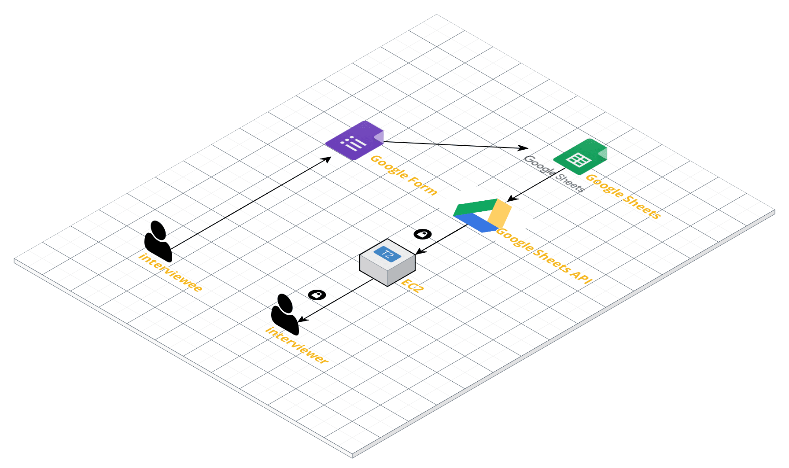

# Sheet Crawler

**‘Google Form 으로 설문조사는 쉽게 받았지만 Spread Sheet로 보기가 너무 불편하다?!**
 여러 단체에서 설문조사를 Google Form을 이용합니다. 조사자의 취향에 맞게 구현할 수 있고 링크로 공유하기 편리하기 때문입니다. 그러나 응답내용이 Google Spread Sheet에 한줄한줄 쌓이기 때문에 한눈에 데이터를 파악하기는 어렵습니다.

**‘Sheet Crawler를 이용하여 응답내용을 편리하게 확인!’** 

 편리하게 설문을 받았지만 응답내용을 관리하기는 쉽지 않습니다. 한눈에 파악하려면 데이터 정제 작업은 물론, 어려운 액셀 함수까지 ㅠㅠ 하지만 `Sheet Crawler`를 이용하면 Database 구축 필요없이! Google Spread Sheet 문서만으로 응답정보는 물론 해당 데이터에 접근 가능한 유저 관리까지 가능합니다.

**‘Version 1. NEXTERS 14th Recruiting’** 
Sheet Crawler를 적용한 첫번째 프로젝트입니다 :)

디자이너와 개발자를 위한 IT 연합동아리 NEXTERS 14th Recruiting에 `Sheet Crawler ` 를 사용하여 편리한 평가환경 구축

- **로그인** | 평가담당 운영진만 접근할 수 있도록 Spring Security를 통해 로그인기능 구현 
- **개발자, 디자이너 지원자 목록 조회** | 기본 정보(이름, 이메일, 전화번호) 를 전체 리스트를 통해 한눈에 파악할 수 있도록 구현
- **지원자 상세 조회** | 기본정보를 포함한 상세한 응답내용을 보기 편한 Card형태로 확인

## 서버 배포

- AWS EC2

## DB

- No DB! Only Google Spread Sheet :)

## 사용된 도구

- Spring Boot 2.1
- Gradle
- IntelliJ
- Git
- **Google Sheets API v4**

## Author

**Developer**

- [inhyuck](https://github.com/inhyuck)

## 참고한 사이트

- [Google Sheets API v4 document](https://developers.google.com/sheets/api/quickstart/java)
  - [example java quick start github](https://github.com/gsuitedevs/java-samples/tree/master/sheets/quickstart)
  - [example java snippets github](https://github.com/gsuitedevs/java-samples/tree/master/sheets/snippets)
- [jojoldu님 Blog](https://jojoldu.tistory.com/) - Spring boot
- [KWANGSIK LEE Blog](http://www.kwangsiklee.com/) - Google Sheets API with Java